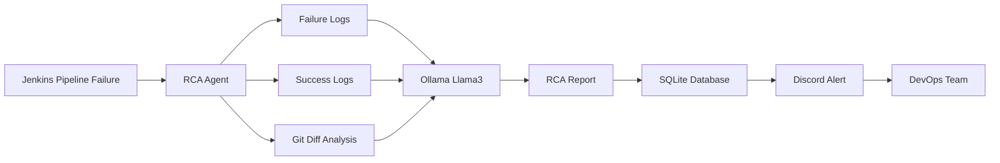
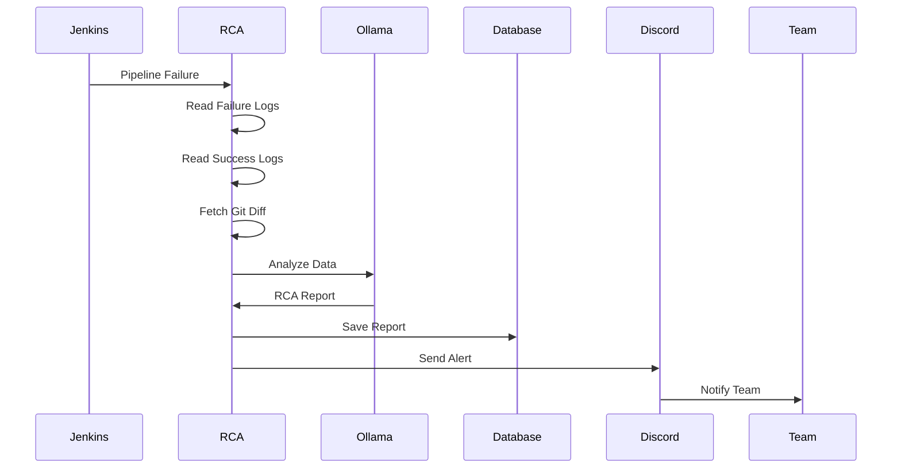
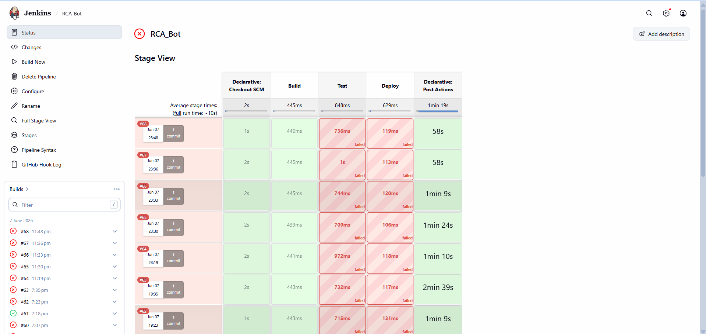
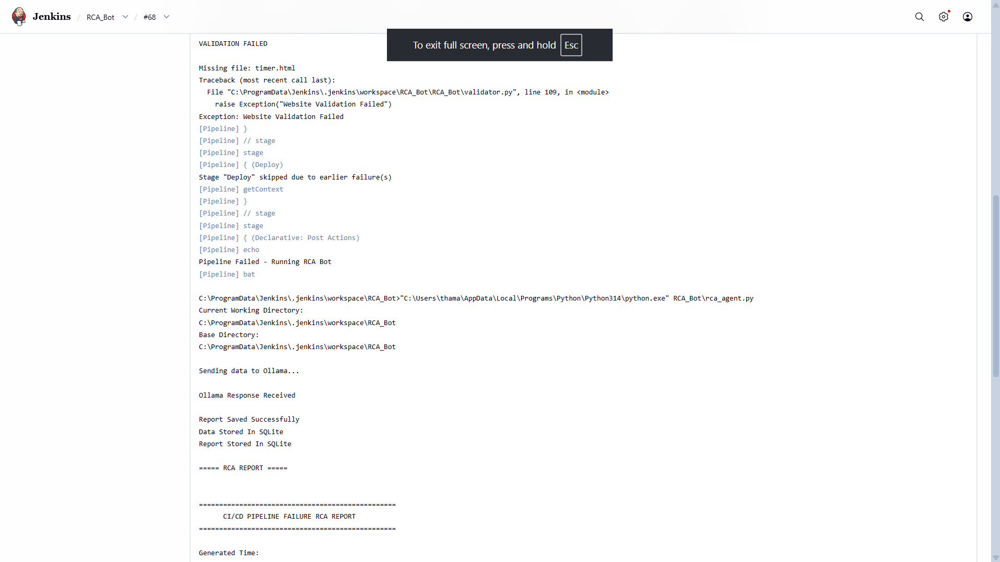
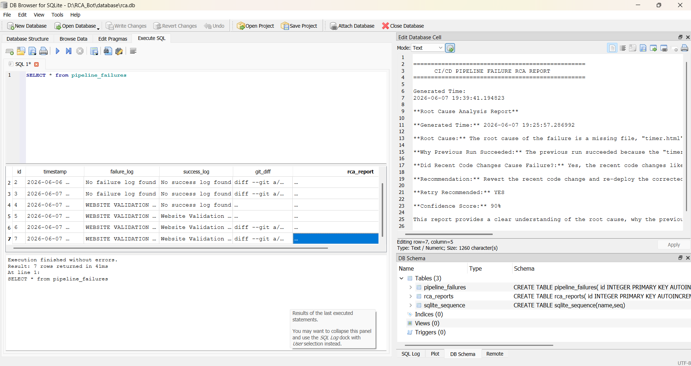
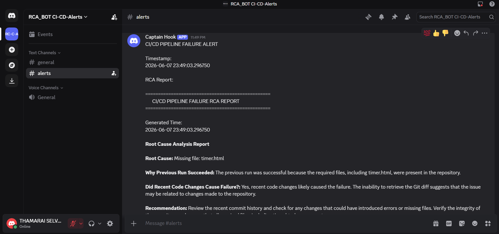

# 🤖 RCA Bot - Pipeline failure RCA Bot

[](https://www.python.org/)
[](https://www.jenkins.io/)
[]()
[]()


---

# 👨‍💻 Project Information

### Team Name

Team 28

### Team Members

* THAMARAI SELVAN S
* SWATHI N 
* SURUTHIKASA S
* SUSHANT KUMAR MISHRA 

## Resume

- **THAMARAI SELVAN S** – [Resume](https://drive.google.com/file/d/1dDDGZb7Q-20d4ixp5kIhoZYulch0hmt5/view?usp=sharing)

- **SWATHI N** – [Resume](https://drive.google.com/file/d/1C-oZ7moiKk6hxlwUpAWct8sJWXULlIYz/view?usp=sharing)

- **SURUTHIKASA S** – [Resume](https://drive.google.com/file/d/1lWouQ4UMoqCafnzaFKIweKdOhxNVz30d/view?usp=sharing)

- **SUSHANT KUMAR MISHRA** – [Resume](https://drive.google.com/drive/folders/1HJLKFlToGPwxQ_enFSCaSjOsXt7y7Wdo)

## Deliverable Links

### GitHub Repository
https://github.com/S-THAMARAI-SELVAN/RCA_Bot

### Demo Video
https://drive.google.com/file/d/1t4fXEJR15P_RxjVa94B-uyDiA61fAJce/view?usp=sharing

### Discord Channel
Real-time pipeline failure alerts and AI-generated RCA recommendations.

Discord Invite:
https://discord.gg/rvr6gyAt

### Deployment
Local deployment using Jenkins, Ollama (Llama 3), SQLite, and Discord Webhooks.

# ◆ Project Overview

RCA Bot (Root Cause Analysis Bot) is an AI-powered DevOps troubleshooting system that automatically analyzes CI/CD pipeline failures and generates intelligent Root Cause Analysis (RCA) reports.

Instead of manually reading hundreds of lines of Jenkins logs, RCA Bot collects failure logs, compares them with previous successful runs, analyzes recent Git changes, and uses Llama 3 through Ollama to identify the most probable root cause and remediation steps.

The generated RCA report is stored in SQLite and instantly shared with the team through Discord notifications.

---

# ◆ Problem Statement

CI/CD pipelines frequently fail due to:

* Configuration issues
* Code deployment errors
* Dependency mismatches
* Infrastructure problems
* Environment variable changes

Finding the exact root cause requires engineers to manually inspect logs, compare builds, and investigate recent commits.

This process consumes significant engineering time and delays incident resolution.

---

# ◆ Solution

RCA Bot automates the entire troubleshooting workflow.

When a Jenkins pipeline fails:

1. Collect Jenkins failure logs
2. Retrieve previous successful execution logs
3. Fetch latest Git changes
4. Analyze all information using AI
5. Generate Root Cause Analysis
6. Store findings in SQLite
7. Send Discord notifications

This significantly reduces debugging effort and accelerates issue resolution.

---

# ◆ System Architecture




# ◆ Features

### Automated Failure Analysis

Automatically detects Jenkins pipeline failures.

### Multi-Source Investigation

Uses:

* Failure Logs
* Success Logs
* Git Diff

for comprehensive analysis.

### AI-Powered RCA

Uses Ollama + Llama3 to generate root cause explanations.

### Historical Tracking

Stores all failures and reports in SQLite.

### Discord Notifications

Instantly alerts the DevOps team.

### Website Validation

Validates HTML, CSS, JavaScript, images, and links before deployment.

### Actionable Recommendations

Provides remediation steps and retry suggestions.

---

# ◆ Technology Stack

| Layer                | Technology       |
| -------------------- | ---------------- |
| Programming Language | Python           |
| CI/CD                | Jenkins          |
| AI Engine            | Ollama + Llama3  |
| Database             | SQLite           |
| Notifications        | Discord Webhooks |
| Version Control      | Git              |
| Validation           | BeautifulSoup    |

---

# 📂 Project Structure

```text
RCA_Bot/

├── RCA_bot/
│   ├── rca_agent.py
│   ├── validator.py
│   ├── db.py
│   └── send_discord_alert.py

├── database/
│   └── rca.db

├── logs/
│   ├── failure.log
│   ├── success.log
│   └── git_diff.log

├── reports/
│   └── rca_report.txt

├── Jenkinsfile

└── README.md
```
---

# ◆ Workflow



---

---

# ◆ Installation

## Clone Repository

```bash
git clone https://github.com/S-THAMARAI-SELVAN/RCA_Bot.git

cd RCA_Bot
```

## Install Dependencies

```bash
pip install requests

pip install beautifulsoup4

pip install ollama
```

## Install Ollama

```bash
ollama pull llama3
```

Verify installation:

```bash
ollama list
```

---

# ▶︎ Running the Project

## Run Validator

```bash
python RCA_bot/validator.py
```

## Run RCA Analysis

```bash
python RCA_bot/rca_agent.py
```

## Send Discord Alert

```bash
python RCA_bot/send_discord_alert.py
```

---

# ◆ Sample RCA Output

```text
ROOT CAUSE ANALYSIS REPORT

Failure Summary:
Deployment failed due to missing environment variable.

Root Cause:
Recent Git commit modified deployment configuration
without updating environment variables.

Impact:
Production deployment blocked while pipeline failures.

Recommendations:
1. Update environment configuration.
2. Validate deployment variables before release.
3. Add configuration validation stage.

Confidence Score:
94%
```

---

# ◆ Key Learning Outcomes

* DevOps Automation
* Jenkins CI/CD Integration
* AI-Powered Troubleshooting
* Local LLM Deployment
* Database Design
* Incident Management
* Root Cause Analysis
* Python Automation

---

# ◆ Future Enhancements

* Slack Integration
* Microsoft Teams Integration
* Dashboard for Historical Reports
* Predictive Failure Detection
* Automated Remediation Actions
* Email Notifications
* Advanced Analytics

---

# ◆ Business Impact

* Reduces manual log investigation effort
* Accelerates CI/CD troubleshooting
* Improves DevOps productivity
* Enables faster incident resolution
* Provides historical RCA tracking

---

# 📸 Screenshots

### Jenkins Pipeline Failure



### Jenkins Console Output



### Generated RCA Report



### Discord Alert



---


# 👨‍💻 Authors

- THAMARAI SELVAN S
- SWATHI N
- SURUTHIKASA S
- SUSHANT KUMAR MISHRA

GitHub:
https://github.com/S-THAMARAI-SELVAN

Project:
RCA Bot – AI-Powered Root Cause Analysis for CI/CD Failures
